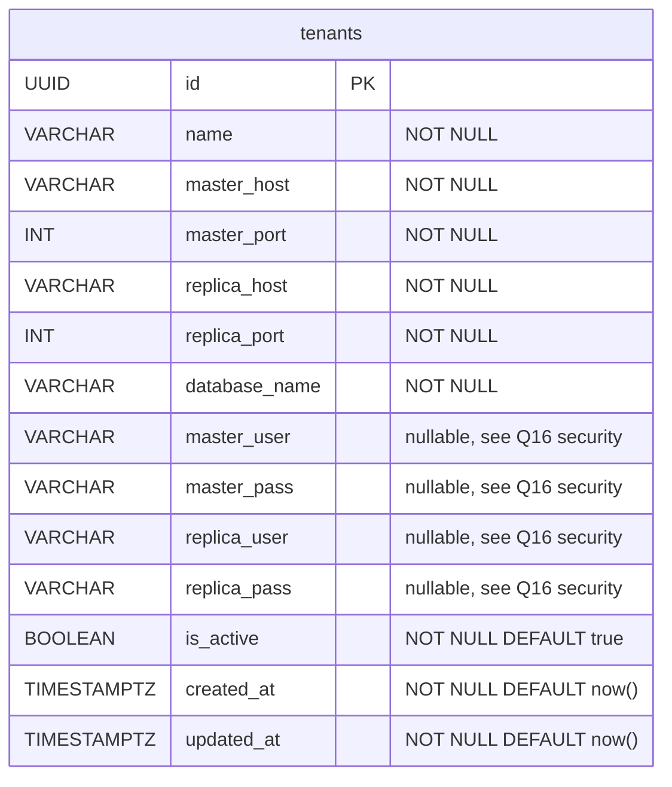

```mermaid
erDiagram
    %% ========== AUTH CLUSTER ==========
    users {
        UUID id PK
        VARCHAR email UK "NOT NULL, UNIQUE"
        VARCHAR username UK "NOT NULL, UNIQUE"
        VARCHAR password_hash "NOT NULL"
        VARCHAR first_name "NOT NULL"
        VARCHAR last_name "NOT NULL"
        user_role role "NOT NULL DEFAULT user"
        user_status status "NOT NULL DEFAULT active"
        VARCHAR bio "nullable"
        TEXT profile_image_url "nullable"
        BOOLEAN email_verified "NOT NULL DEFAULT false"
        TIMESTAMPTZ last_login_at "nullable"
        INT login_attempts "NOT NULL DEFAULT 0"
        TIMESTAMPTZ locked_until "nullable"
        JSON preferences "NOT NULL DEFAULT {}"
        JSON metadata "NOT NULL DEFAULT {}"
        TIMESTAMPTZ created_at "NOT NULL DEFAULT now()"
        TIMESTAMPTZ updated_at "NOT NULL DEFAULT now()"
        TIMESTAMPTZ deleted_at "nullable, soft delete"
    }

    otp_codes {
        UUID id PK
        UUID user_id FK "NOT NULL"
        VARCHAR otp_hash "NOT NULL, never raw"
        otp_purpose purpose "NOT NULL"
        TIMESTAMPTZ expires_at "NOT NULL"
        INT attempt_count "NOT NULL DEFAULT 0"
        BOOLEAN used "NOT NULL DEFAULT false"
        TIMESTAMPTZ created_at "NOT NULL DEFAULT now()"
    }

    refresh_tokens {
        UUID id PK
        UUID user_id FK "NOT NULL"
        VARCHAR token_hash "NOT NULL, never raw"
        TIMESTAMPTZ expires_at "NOT NULL"
        TIMESTAMPTZ revoked_at "nullable"
        TIMESTAMPTZ created_at "NOT NULL DEFAULT now()"
    }

    user_devices {
        UUID id PK
        UUID user_id FK "NOT NULL"
        VARCHAR fcm_token "NOT NULL"
        device_platform platform "NOT NULL"
        UUID device_id "NOT NULL"
        TIMESTAMPTZ created_at "NOT NULL DEFAULT now()"
        TIMESTAMPTZ updated_at "NOT NULL DEFAULT now()"
    }

    users ||--o{ otp_codes : "receives OTPs"
    users ||--o{ refresh_tokens : "holds refresh tokens"
    users ||--o{ user_devices : "registers devices"

    %% ========== CRITERIA LIBRARY ==========
    criteria {
        UUID id PK
        UUID created_by FK "NOT NULL"
        VARCHAR title "NOT NULL"
        TEXT description "NOT NULL"
        criteria_status status "DEFAULT active"
        JSON metadata "NOT NULL DEFAULT {}"
        TIMESTAMPTZ created_at "NOT NULL DEFAULT now()"
        TIMESTAMPTZ updated_at "NOT NULL DEFAULT now()"
        TIMESTAMPTZ deleted_at "nullable, soft delete"
    }

    users ||--o{ criteria : "owns criteria"

    %% ========== SKILLS LIBRARY ==========
    skills {
        UUID id PK
        VARCHAR name UK "NOT NULL, UNIQUE"
        UUID created_by FK "NOT NULL"
        TIMESTAMPTZ created_at "NOT NULL DEFAULT now()"
        TIMESTAMPTZ updated_at "NOT NULL DEFAULT now()"
    }

    users ||--o{ skills : "creates skills"

    %% ========== JOB CLUSTER ==========
    jobs {
        UUID id PK
        VARCHAR title "NOT NULL"
        TEXT description "NOT NULL, HTML"
        VARCHAR category "NOT NULL"
        VARCHAR job_code "nullable"
        VARCHAR embedded_email "nullable"
        UUID created_by FK "NOT NULL"
        UUID updated_by FK "nullable"
        TIMESTAMPTZ created_at "NOT NULL DEFAULT now()"
        TIMESTAMPTZ updated_at "NOT NULL DEFAULT now()"
    }

    job_criteria {
        UUID id PK
        UUID job_id FK "NOT NULL"
        UUID criteria_id FK "NOT NULL"
        TIMESTAMPTZ created_at "NOT NULL DEFAULT now()"
        TIMESTAMPTZ updated_at "NOT NULL DEFAULT now()"
    }

    job_skills {
        UUID id PK
        UUID job_id FK "NOT NULL"
        UUID skill_id FK "NOT NULL"
        TIMESTAMPTZ created_at "NOT NULL DEFAULT now()"
        TIMESTAMPTZ updated_at "NOT NULL DEFAULT now()"
    }

    users ||--o{ jobs : "creates jobs"
    jobs ||--o{ job_criteria : "uses criteria"
    criteria ||--o{ job_criteria : "linked to jobs"
    jobs ||--o{ job_skills : "requires skills"
    skills ||--o{ job_skills : "linked to jobs"

    %% ========== RESUME / CV CLUSTER ==========
    cv_folders {
        UUID id PK
        UUID created_by FK "NOT NULL"
        VARCHAR name "NOT NULL"
        INT file_count "NOT NULL DEFAULT 0, denormalized"
        TIMESTAMPTZ created_at "NOT NULL DEFAULT now()"
        TIMESTAMPTZ updated_at "NOT NULL DEFAULT now()"
    }

    resumes {
        UUID id PK
        UUID created_by FK "NOT NULL"
        UUID folder_id FK "nullable"
        VARCHAR file_name "NOT NULL"
        VARCHAR file_url "NOT NULL"
        VARCHAR file_type "nullable"
        VARCHAR file_size "nullable"
        VARCHAR file_extension "nullable"
        VARCHAR storage_key "nullable, Drive ID or S3 key"
        TIMESTAMPTZ created_at "NOT NULL DEFAULT now()"
        TIMESTAMPTZ updated_at "NOT NULL DEFAULT now()"
    }

    users ||--o{ cv_folders : "owns folders"
    users ||--o{ resumes : "uploads resumes"
    cv_folders ||--o{ resumes : "contains resumes"

    %% ========== JOB ↔ RESUME LINK (M2M) ==========
    job_resumes {
        UUID id PK
        UUID job_id FK "NOT NULL"
        UUID resume_id FK "NOT NULL"
        UUID created_by FK "NOT NULL"
        TIMESTAMPTZ created_at "NOT NULL DEFAULT now()"
        TIMESTAMPTZ updated_at "NOT NULL DEFAULT now()"
    }

    jobs ||--o{ job_resumes : "receives resumes"
    resumes ||--o{ job_resumes : "attached to jobs"

    %% ========== JOB RESPONSES (CANDIDATES) ==========
    job_responses {
        UUID id PK
        UUID job_id FK "NOT NULL"
        UUID resume_id FK "NOT NULL"
        VARCHAR candidate_name "nullable"
        VARCHAR candidate_email "nullable"
        VARCHAR candidate_phone "nullable"
        TEXT candidate_address "nullable"
        VARCHAR candidate_domain "nullable"
        VARCHAR candidate_role "nullable"
        candidate_status status "NOT NULL DEFAULT recommended"
        INT experience_score "nullable"
        INT skills_score "nullable"
        INT education_score "nullable"
        UUID created_by FK "NOT NULL"
        TIMESTAMPTZ created_at "NOT NULL DEFAULT now()"
        TIMESTAMPTZ updated_at "NOT NULL DEFAULT now()"
    }

    job_response_tags {
        UUID id PK
        UUID job_response_id FK "NOT NULL"
        VARCHAR tag_name "NOT NULL"
        TIMESTAMPTZ created_at "NOT NULL DEFAULT now()"
        TIMESTAMPTZ updated_at "NOT NULL DEFAULT now()"
    }

    jobs ||--o{ job_responses : "evaluates candidates"
    resumes ||--o{ job_responses : "sourced from resume"
    job_responses ||--o{ job_response_tags : "tagged with"

    %% ========== BACKGROUND PROCESSING ==========
    analysis_jobs {
        UUID id PK
        UUID job_id FK "NOT NULL"
        UUID resume_id FK "NOT NULL"
        analysis_status status "NOT NULL DEFAULT pending"
        TEXT error_message "nullable"
        TIMESTAMPTZ started_at "nullable"
        TIMESTAMPTZ completed_at "nullable"
        INT attempt_count "NOT NULL DEFAULT 0"
        TIMESTAMPTZ created_at "NOT NULL DEFAULT now()"
        TIMESTAMPTZ updated_at "NOT NULL DEFAULT now()"
    }

    jobs ||--o{ analysis_jobs : "triggers analysis"
    resumes ||--o{ analysis_jobs : "analyzed resume"
```

x`# XpertAssistant — Database Schema (Revised)

> **Revision context:** This document supersedes the original `database-schema.md`. It reconciles four sources of truth: (1) the current frontend codebase, (2) the original schema document, (3) the instructor's `xpert_assistant_...sql` tenants dump, and (4) the instructor's `xpert_dev_db_...sql` application schema dump.

---

## 1. What Changed and Why

### 1a. Auth flow changed (OTP-only → Password + OTP)

The original schema was written against an OTP-only passwordless flow. The frontend has since been rewritten to a standard **email + password** auth flow:

- **Register** (`/register`): email + password → OTP verification → session established. Confirmed in [register-form.tsx](file:///a:/XpertAssistant/src/app/(auth)/components/register-form.tsx) and [use-register.ts](file:///a:/XpertAssistant/src/lib/hooks/use-register.ts).
- **Login** (`/login`): email + password only — no OTP step. Confirmed in [login-form.tsx](file:///a:/XpertAssistant/src/app/(auth)/components/login-form.tsx).
- **Forgot password** (`/forgot-password` → `/forgot-password/verify` → `/reset-password`): email → OTP → new password + confirm password. Confirmed in [forgot-password-form.tsx](file:///a:/XpertAssistant/src/app/(auth)/components/forgot-password-form.tsx), [reset-password-form.tsx](file:///a:/XpertAssistant/src/app/(auth)/components/reset-password-form.tsx).
- **OTP form** is now generalized and reused by both registration verification and forgot-password verification. Confirmed in [otp-form.tsx](file:///a:/XpertAssistant/src/app/(auth)/components/otp-form.tsx).

**Impact:** The `users` table now needs a `password_hash` column. The `otp_codes` table is retained (used for registration verification and password-reset OTP) but its usage context changes. The `refresh_tokens` table is retained for JWT rotation (confirmed by `AuthResponse.accessToken` + `AuthResponse.refreshToken` in [auth.types.ts](file:///a:/XpertAssistant/src/types/auth.types.ts)).

Current types from [auth.types.ts](file:///a:/XpertAssistant/src/types/auth.types.ts):
- `RegisterRequest { email, password? }`
- `VerifyRegistrationOtpRequest { email, code }`
- `LoginRequest { email, password? }`
- `ForgotPasswordRequest { email }`
- `VerifyResetOtpRequest { email, code }`
- `ResetPasswordRequest { resetToken, newPassword?, confirmPassword? }`
- `AuthUser { id, email, name?, role? }`
- `AuthResponse { accessToken, refreshToken, user }`

### 1b. Two-backend merged to single backend

The original schema noted `aiApiUrl` / `ai-client.ts`. These have been consolidated into a single backend URL. Confirmed in [env.ts](file:///a:/XpertAssistant/src/lib/api/env.ts): `apiUrl` is the single exported URL. `ai-client.ts` has been deleted; `analysis.service.ts` now uses `coreClient.post()` with `{ timeoutMs: 30000 }`. **No schema impact** — this was a frontend plumbing change only.

### 1c. Multi-tenancy (new)

The instructor's [xpert_assistant_...sql](file:///a:/XpertAssistant/xpert_assistant_20260903_172756.sql) reveals a **database-per-tenant** physical isolation model. A central "control-plane" database (`xpert_assistant`) holds a `tenants` table with connection credentials to N separate per-tenant databases (`xpert_dev_db`, `xpert_demo_db`, `xpert_beyondrecruitment_db`, etc.).

**Impact:** Two categories of DDL are required:
1. **Control-plane schema** — the `tenants` table (plus nothing else — no `platform_admins` table exists anywhere in the codebase).
2. **Per-tenant application schema** — everything else (users, jobs, criteria, resumes, candidates, etc.), instantiated fresh in each new tenant database.

Since each tenant gets its own isolated database, **no table in the per-tenant schema needs a `tenant_id` column**. The database boundary *is* the tenant boundary.

### 1d. Instructor's reference schema conflicts (resolved)

The instructor's [xpert_dev_db_...sql](file:///a:/XpertAssistant/xpert_dev_db_20260903_172826.sql) introduces several entities and conventions that conflict with the original schema. Each conflict is explicitly resolved in Section 2 below.

### 1e. What did NOT change

The following types/entities from the original investigation are **unchanged** — no re-derivation needed:
- `Job`, `JobCategory`, `JobCriterion`, `CreateJobPayload`, `JobDetail` — confirmed identical in [job.types.ts](file:///a:/XpertAssistant/src/types/job.types.ts).
- `Candidate`, `CandidateStatus`, `CandidateScoreBreakdown`, `JobCandidatesResponse` — confirmed identical in [candidate.types.ts](file:///a:/XpertAssistant/src/types/candidate.types.ts).
- `CvFile`, `CvFileType`, `CvFolder` — confirmed identical in [cv.types.ts](file:///a:/XpertAssistant/src/types/cv.types.ts).
- Mock data shapes in `jobs.json`, `candidates.json`, `cv-files.json`, `cv-folders.json`, `criteria.json`, `job-detail.json` — no drift detected.
- The wizard flow (`wizard-context.tsx`, `step-upload-resume.tsx`, `step-job-details.tsx`) — no drift detected.

---

## 2. Open Questions & Judgment Calls

### Q1 (REVISED): Skills — `TEXT[]` array vs. normalized join table?

**Previous decision:** `TEXT[]` column on `jobs`.

**New evidence:** The instructor's schema has a dedicated `skills` table with a `job_skills` join table (M2M), including FK constraints and unique indexes.

**Revised decision: Adopt the instructor's normalized `skills` + `job_skills` approach.**

**Reasoning:** The instructor explicitly provided this structure, which implies skills should be a managed, reusable lookup. A normalized table enables cross-job skill analytics (e.g. "which skills appear most across all jobs?"), prevents inconsistent spelling of the same skill, and follows the instructor's demonstrated design intent. The frontend's `string[]` type doesn't change — the API layer serializes the join into an array for the frontend. The `CHECK (cardinality(skills) <= 10)` constraint from the old schema is replaced by application-layer validation (already exists in `wizard-context.tsx` L79).

### Q2 (UNCHANGED): Derived stats — `shortListCount`, `resumeCount`, `analysisRatio`

**Decision:** Still computed via `v_job_stats` view, not stored columns. No new evidence contradicts this.

### Q3 (UNCHANGED): Candidate `cvDownloadUrl` — derived at API layer

**Decision:** Still derived, not stored. No new evidence contradicts this.

### Q4 (UNCHANGED): `CvFolder.fileCount` — intentionally denormalized

**Decision:** Still denormalized per `cv.types.ts` comment. No new evidence contradicts this.

### Q5 (REVISED): Password-reset approach — column on `users` vs. separate table

**Instructor's schema:** `passwordResetToken` and `passwordResetExpires` directly on the `users` table.

**Previous schema:** Separate `otp_codes` table with hashed values.

**Decision: Keep the separate `otp_codes` table approach, but add a `purpose` enum to distinguish registration-OTP from password-reset-OTP.**

**Reasoning:** The current frontend uses OTP codes for both registration verification and password reset. A single `otp_codes` table with a `purpose` column handles both cleanly. Storing the token directly on `users` would require nulling two columns on every reset, can only support one outstanding token at a time, and stores tokens as plaintext VARCHAR (the instructor's dump has no hashing). The separate-table approach is: revocable (delete old codes), auditable (history of attempts), supports concurrent flows (register OTP + reset OTP), and stores hashed values.

The `resetToken` in `ResetPasswordRequest` (a short-lived signed token returned after successful OTP verification, used to authorize the actual password change) is distinct from the OTP code itself. This token is stateless (JWT-like, validated server-side) — no database storage needed for it.

### Q6 (SUPERSEDED): User ownership / `created_by`

**Previous decision:** Add `user_id` FK on jobs, folders, files.

**Updated decision:** Adopt the instructor's convention of `created_by` (referencing `users.id`) instead of `user_id`. The instructor's schema consistently uses `created_by` on `jobs`, `resumes`, `skills`, `job_resumes`, `job_responses`. This naming is clearer about intent ("who created this") and also allows `updated_by` as a companion column.

### Q7 (UNCHANGED): `candidate.role` is the professional title

No new evidence contradicts this.

### Q8 (REVISED): Background analysis tracking

**Decision:** Keep `analysis_jobs` table. No contradicting evidence in the instructor's dump (it doesn't have an equivalent, but the frontend's async LLM flow via `analysis.service.ts` with a 30-second timeout confirms the need).

### Q9 (NEW): Naming convention — camelCase vs. snake_case

**Finding:** The instructor's dump has an inconsistent mix:
- **camelCase (quoted):** `users` table (`"userId"`, `"createdAt"`, `"firstName"`, `"emailVerified"`, etc.), `criteria` table (`"userId"`, `"createdAt"`), `"user-device"` table.
- **snake_case (unquoted):** `jobs`, `job_criteria`, `job_skills`, `job_resumes`, `job_responses`, `resumes`, `skills`.

**Decision: Normalize all columns to `snake_case` unquoted.**

**Reasoning:** snake_case is the PostgreSQL-idiomatic default (unquoted identifiers are lowercased automatically). The majority of the instructor's own tables already use snake_case. Quoted camelCase identifiers create maintenance friction (every query must quote them) and suggest ORM-generated output (likely Sequelize) rather than intentional design. The backend Fastify layer can trivially map `snake_case` DB columns to `camelCase` JSON fields.

### Q10 (NEW): Resume/CV file storage — local vs. Google Drive

**Finding:** The instructor's `resumes` table has a `file_id` column with comment "Google Drive file ID", plus `file_url` (VARCHAR 500).

**Frontend evidence:** `CvFile.downloadUrl` is a plain URL string. `cvs.service.ts` uploads via `FormData` to `/cvs/upload`. No Google Drive SDK or API key reference exists anywhere in the frontend codebase.

**Decision: Design the schema to be storage-agnostic.** Keep both `file_url` (the downloadable URL, regardless of backend — could be Google Drive, S3, or local) and `storage_key` (an opaque identifier — could be a Drive file ID, an S3 key, or a filesystem path). The backend decides which storage provider to use; the schema just stores the result. Flag this as a configuration decision for the backend team.

### Q11 (NEW): `job_responses` vs. `candidates` naming

**Finding:** The instructor's dump uses `job_responses` for what the frontend calls "candidates". Mapping:

| Instructor `job_responses` | Frontend `Candidate` | Notes |
|---|---|---|
| `candidate_name` | `name` | ✓ Match |
| `candidate_email` | `email` | ✓ Match |
| `candidate_phone` | `phone` | ✓ Match |
| `candidate_address` | `address` | ✓ Match |
| `candidate_domain` | — | ⚠️ Instructor only, not in frontend |
| `experience_score` | `scoreBreakdown.experience` | ✓ Match |
| `skills_score` | `scoreBreakdown.skills` | ✓ Match |
| `education_score` | `scoreBreakdown.education` | ✓ Match |
| — | `role` | ⚠️ Frontend only (professional title) |
| — | `status` | ⚠️ Frontend only (recommended/shortlisted/rejected) |
| — | `cvFileId` | ⚠️ Frontend only (via `resume_id` FK) |
| — | `cvDownloadUrl` | Derived, not stored |
| — | `uploadedAt` | Frontend only |
| `resume_id` | `cvFileId` | Different name, same concept |
| `created_by` | — | Instructor only |

**Decision:** Name the table `job_responses` (matching instructor's convention, since this table represents the AI's "response" about a candidate for a specific job). Include all fields from both sources: `candidate_domain` from the instructor (useful for AI classification), `status` and `role` from the frontend (needed by the UI). The `job_response_tags` table from the instructor is also carried forward.

### Q12 (NEW): `criteria` as user-owned reusable templates vs. job-scoped

**Finding:** The instructor's schema has `criteria` as a **standalone, user-owned table** (with `"userId"` FK, `status` enum, `metadata` JSON), linked to jobs via a `job_criteria` **join table**. This is fundamentally different from the original schema where criteria were direct children of jobs.

**Decision: Adopt the instructor's model.** Criteria are user-owned reusable templates. A user creates criteria in their library, then links them to specific jobs via `job_criteria`. This enables reusing the same criterion across multiple jobs and managing a criteria library. The frontend's `JobDetail.criteria: JobCriterion[]` doesn't change — the API serializes the join.

### Q13 (NEW): `users` table — instructor's fields vs. frontend's `AuthUser`

**Instructor's `users` has:** `username`, `firstName`, `lastName`, `bio`, `profile_image_url`, `preferences` (JSON), `metadata` (JSON), `deletedAt` (soft delete), `loginAttempts`, `lockedUntil`, `lastLoginAt`.

**Frontend's `AuthUser` has:** `id`, `email`, `name?`, `role?`.

**Decision:** Carry forward the instructor's richer user model. The frontend's `AuthUser` is a minimal DTO — the backend can return just `{ id, email, name: firstName + ' ' + lastName, role }` from the full user row. The additional fields (username, bio, profile_image_url, preferences, login security fields) are backend infrastructure that the frontend doesn't need to know about yet but will when profile pages are built.

### Q14 (NEW): `user_devices` table

**Finding:** The instructor has a `"user-device"` table tracking FCM tokens and device platforms (android, web) for push notifications.

**Decision:** Carry forward as `user_devices` (snake_case normalized). Not referenced by the frontend currently, but it's in the instructor's reference schema and is legitimate backend infrastructure.

### Q15 (NEW): Soft deletes (`deleted_at`)

**Finding:** The instructor's `users` and `criteria` tables have a `"deletedAt"` column for soft deletes.

**Decision:** Add `deleted_at TIMESTAMPTZ` to `users` and `criteria`. This is standard practice for audit trails and data recovery. Tables that represent transactional data (job_responses, job_resumes) use hard deletes via `ON DELETE CASCADE`.

### Q16 (NEW): Security finding — plaintext credentials in tenants table

The `tenants` table stores `masterUser`, `masterPass`, `replicaUser`, `replicaPass` as plaintext `VARCHAR(255)`. In production, these should be:
- Encrypted at rest using application-level encryption (AES-256-GCM) with a key stored in a secrets manager (AWS Secrets Manager, HashiCorp Vault, etc.)
- Or pulled at runtime from a secrets manager rather than stored in the database at all.

**This is flagged as an open security finding, not fixed in this schema** — the fix requires backend application changes, not just DDL changes.

---

## 3. ER Diagrams

### 3a. Control-Plane Schema (run on `xpert_assistant` database)



### 3b. Per-Tenant Application Schema (run on each `xpert_<name>_db` database)



---

## 4. PostgreSQL DDL

### 4a. Control-Plane Schema (run ONCE on the `xpert_assistant` database)

```sql
-- ============================================================================
-- CONTROL-PLANE SCHEMA — xpert_assistant database
--
-- Contains only the tenants registry. Each row represents a separate
-- tenant with its own isolated database. The Fastify backend reads this
-- table to dynamically route requests to the correct tenant database
-- based on the incoming request context (subdomain, header, JWT claim, etc.).
-- ============================================================================

CREATE EXTENSION IF NOT EXISTS pgcrypto;

-- ============================================================================
-- TRIGGER FUNCTION: auto-maintain updated_at
-- ============================================================================

CREATE OR REPLACE FUNCTION set_updated_at()
RETURNS TRIGGER AS $$
BEGIN
    NEW.updated_at = now();
    RETURN NEW;
END;
$$ LANGUAGE plpgsql;

-- ============================================================================
-- TABLE: tenants
-- The master registry of all tenant databases.
--
-- SECURITY WARNING (Q16): master_pass and replica_pass are stored as
-- plaintext VARCHAR in the instructor's reference dump. In production,
-- these MUST be encrypted at rest (application-level AES-256-GCM) or
-- pulled from a secrets manager at runtime. This DDL preserves the
-- current structure but flags this as an open security finding.
-- ============================================================================

CREATE TABLE tenants (
    id             UUID PRIMARY KEY DEFAULT gen_random_uuid(),
    name           VARCHAR(255)  NOT NULL,
    master_host    VARCHAR(255)  NOT NULL,
    master_port    INT           NOT NULL,
    replica_host   VARCHAR(255)  NOT NULL,
    replica_port   INT           NOT NULL,
    database_name  VARCHAR(255)  NOT NULL,
    master_user    VARCHAR(255),              -- should be encrypted in production
    master_pass    VARCHAR(255),              -- should be encrypted in production
    replica_user   VARCHAR(255),              -- should be encrypted in production
    replica_pass   VARCHAR(255),              -- should be encrypted in production
    is_active      BOOLEAN       NOT NULL DEFAULT true,
    created_at     TIMESTAMPTZ   NOT NULL DEFAULT now(),
    updated_at     TIMESTAMPTZ   NOT NULL DEFAULT now()
);

CREATE TRIGGER trg_tenants_updated_at
    BEFORE UPDATE ON tenants
    FOR EACH ROW EXECUTE FUNCTION set_updated_at();

COMMENT ON TABLE tenants IS 'Control-plane registry of tenant databases. Each row = one isolated tenant DB.';
COMMENT ON COLUMN tenants.master_pass IS 'SECURITY: stored plaintext per instructor reference — must be encrypted at rest or moved to a secrets manager in production.';
COMMENT ON COLUMN tenants.replica_pass IS 'SECURITY: stored plaintext per instructor reference — must be encrypted at rest or moved to a secrets manager in production.';
```

---

### 4b. Per-Tenant Application Schema (run ONCE per new tenant database)

```sql
-- ============================================================================
-- PER-TENANT APPLICATION SCHEMA
--
-- Run this DDL against each new tenant database (e.g. xpert_dev_db,
-- xpert_demo_db) when provisioning a new tenant. Every table here is
-- tenant-scoped by definition — the entire database IS the tenant
-- boundary, so no table needs a tenant_id column.
--
-- Naming convention: snake_case unquoted identifiers throughout.
-- The instructor's reference dump mixed camelCase (quoted) and snake_case;
-- this schema normalizes everything to snake_case (Q9).
-- ============================================================================

CREATE EXTENSION IF NOT EXISTS pgcrypto;

-- ============================================================================
-- ENUM TYPES
-- ============================================================================

-- User roles within a tenant (instructor's enum_users_role)
CREATE TYPE user_role AS ENUM ('user', 'admin', 'moderator');

-- User account status (instructor's enum_users_status)
CREATE TYPE user_status AS ENUM ('active', 'inactive', 'suspended');

-- Criteria active/inactive status (instructor's enum_criteria_status)
CREATE TYPE criteria_status AS ENUM ('active', 'inactive');

-- OTP purpose — distinguishes registration verification from password reset
CREATE TYPE otp_purpose AS ENUM ('registration', 'password_reset');

-- Candidate evaluation status (frontend's CandidateStatus)
CREATE TYPE candidate_status AS ENUM ('recommended', 'shortlisted', 'rejected');

-- Device platform for push notifications (instructor's enum_user-device_platform)
CREATE TYPE device_platform AS ENUM ('android', 'web');

-- Background analysis job status
CREATE TYPE analysis_status AS ENUM ('pending', 'processing', 'completed', 'failed');

-- ============================================================================
-- TRIGGER FUNCTION: auto-maintain updated_at
-- ============================================================================

CREATE OR REPLACE FUNCTION set_updated_at()
RETURNS TRIGGER AS $$
BEGIN
    NEW.updated_at = now();
    RETURN NEW;
END;
$$ LANGUAGE plpgsql;

-- ============================================================================
-- TABLE: users
-- Depends on: nothing
--
-- Reconciled from: instructor's users table + frontend AuthUser + auth flow.
-- Instructor's camelCase columns normalized to snake_case (Q9).
-- password_hash replaces instructor's plaintext "password" column name
-- to emphasize that raw passwords must never be stored (bcrypt/argon2).
-- emailVerificationToken column from instructor is NOT carried forward —
-- the current frontend uses OTP-based verification, not token links (Q5).
-- ============================================================================

CREATE TABLE users (
    id                UUID PRIMARY KEY DEFAULT gen_random_uuid(),
    email             VARCHAR(320)  NOT NULL,     -- RFC 5321 max
    username          VARCHAR(255)  NOT NULL,
    password_hash     VARCHAR(255)  NOT NULL,     -- bcrypt/argon2, never plaintext
    first_name        VARCHAR(255)  NOT NULL,
    last_name         VARCHAR(255)  NOT NULL,
    role              user_role     NOT NULL DEFAULT 'user',
    status            user_status   NOT NULL DEFAULT 'active',
    bio               VARCHAR(500),
    profile_image_url TEXT,
    email_verified    BOOLEAN       NOT NULL DEFAULT false,
    last_login_at     TIMESTAMPTZ,
    login_attempts    INT           NOT NULL DEFAULT 0,
    locked_until      TIMESTAMPTZ,
    preferences       JSON          NOT NULL DEFAULT '{}'::json,
    metadata          JSON          NOT NULL DEFAULT '{}'::json,
    created_at        TIMESTAMPTZ   NOT NULL DEFAULT now(),
    updated_at        TIMESTAMPTZ   NOT NULL DEFAULT now(),
    deleted_at        TIMESTAMPTZ,                -- soft delete (Q15)

    CONSTRAINT uq_users_email    UNIQUE (email),
    CONSTRAINT uq_users_username UNIQUE (username)
);

CREATE TRIGGER trg_users_updated_at
    BEFORE UPDATE ON users
    FOR EACH ROW EXECUTE FUNCTION set_updated_at();

CREATE INDEX idx_users_email      ON users (email);
CREATE INDEX idx_users_username   ON users (username);
CREATE INDEX idx_users_status     ON users (status);
CREATE INDEX idx_users_created_at ON users (created_at);

COMMENT ON TABLE users IS 'Tenant users. Auth is email+password with OTP verification. password_hash stores bcrypt/argon2 — never plaintext.';

-- ============================================================================
-- TABLE: otp_codes
-- Depends on: users
-- Handles OTP for both registration verification and password reset (Q5).
-- purpose enum distinguishes the two flows.
-- ============================================================================

CREATE TABLE otp_codes (
    id            UUID PRIMARY KEY DEFAULT gen_random_uuid(),
    user_id       UUID         NOT NULL
                  REFERENCES users(id) ON DELETE CASCADE,
    otp_hash      VARCHAR(128) NOT NULL,           -- bcrypt/argon2 hash, never raw
    purpose       otp_purpose  NOT NULL,
    expires_at    TIMESTAMPTZ  NOT NULL,
    attempt_count INT          NOT NULL DEFAULT 0,
    used          BOOLEAN      NOT NULL DEFAULT false,
    created_at    TIMESTAMPTZ  NOT NULL DEFAULT now()
);

CREATE INDEX idx_otp_codes_user_active
    ON otp_codes (user_id, purpose, used, expires_at);

COMMENT ON TABLE otp_codes IS 'Hashed OTP codes for registration verification and password reset. Never stores raw codes.';

-- ============================================================================
-- TABLE: refresh_tokens
-- Depends on: users
-- JWT refresh token rotation and revocation support.
-- ============================================================================

CREATE TABLE refresh_tokens (
    id         UUID PRIMARY KEY DEFAULT gen_random_uuid(),
    user_id    UUID         NOT NULL
               REFERENCES users(id) ON DELETE CASCADE,
    token_hash VARCHAR(128) NOT NULL,
    expires_at TIMESTAMPTZ  NOT NULL,
    revoked_at TIMESTAMPTZ,
    created_at TIMESTAMPTZ  NOT NULL DEFAULT now()
);

CREATE INDEX idx_refresh_tokens_user_active
    ON refresh_tokens (user_id, revoked_at, expires_at);

COMMENT ON TABLE refresh_tokens IS 'Hashed JWT refresh tokens supporting rotation and explicit revocation.';

-- ============================================================================
-- TABLE: user_devices
-- Depends on: users
-- Push notification device registration (from instructor's "user-device").
-- Normalized to snake_case (was quoted camelCase "user-device").
-- ============================================================================

CREATE TABLE user_devices (
    id         UUID PRIMARY KEY DEFAULT gen_random_uuid(),
    user_id    UUID             NOT NULL
               REFERENCES users(id) ON DELETE CASCADE,
    fcm_token  VARCHAR(255)     NOT NULL,
    platform   device_platform  NOT NULL,
    device_id  UUID             NOT NULL,
    created_at TIMESTAMPTZ      NOT NULL DEFAULT now(),
    updated_at TIMESTAMPTZ      NOT NULL DEFAULT now()
);

CREATE TRIGGER trg_user_devices_updated_at
    BEFORE UPDATE ON user_devices
    FOR EACH ROW EXECUTE FUNCTION set_updated_at();

CREATE UNIQUE INDEX idx_user_devices_unique
    ON user_devices (user_id, device_id, platform);

COMMENT ON TABLE user_devices IS 'FCM push notification device registry. Migrated from instructor "user-device" table.';

-- ============================================================================
-- TABLE: criteria
-- Depends on: users
-- User-owned reusable evaluation criteria templates (Q12).
-- Linked to specific jobs via job_criteria join table.
-- ============================================================================

CREATE TABLE criteria (
    id          UUID PRIMARY KEY DEFAULT gen_random_uuid(),
    created_by  UUID             NOT NULL
                REFERENCES users(id) ON DELETE CASCADE,
    title       VARCHAR(255)     NOT NULL,
    description TEXT             NOT NULL,
    status      criteria_status  NOT NULL DEFAULT 'active',
    metadata    JSON             NOT NULL DEFAULT '{}'::json,
    created_at  TIMESTAMPTZ      NOT NULL DEFAULT now(),
    updated_at  TIMESTAMPTZ      NOT NULL DEFAULT now(),
    deleted_at  TIMESTAMPTZ                                    -- soft delete (Q15)
);

CREATE TRIGGER trg_criteria_updated_at
    BEFORE UPDATE ON criteria
    FOR EACH ROW EXECUTE FUNCTION set_updated_at();

CREATE INDEX idx_criteria_created_by ON criteria (created_by);
CREATE INDEX idx_criteria_created_at ON criteria (created_at);

COMMENT ON TABLE criteria IS 'User-owned reusable evaluation criteria. Linked to jobs via job_criteria M2M join.';

-- ============================================================================
-- TABLE: skills
-- Depends on: users
-- Managed, reusable skill lookup (Q1 revised — adopted instructor's model).
-- ============================================================================

CREATE TABLE skills (
    id         UUID PRIMARY KEY DEFAULT gen_random_uuid(),
    name       VARCHAR(50)  NOT NULL,
    created_by UUID         NOT NULL
               REFERENCES users(id) ON DELETE CASCADE,
    created_at TIMESTAMPTZ  NOT NULL DEFAULT now(),
    updated_at TIMESTAMPTZ  NOT NULL DEFAULT now(),

    CONSTRAINT uq_skills_name UNIQUE (name)
);

CREATE TRIGGER trg_skills_updated_at
    BEFORE UPDATE ON skills
    FOR EACH ROW EXECUTE FUNCTION set_updated_at();

CREATE INDEX idx_skills_name       ON skills (name);
CREATE INDEX idx_skills_created_by ON skills (created_by);

COMMENT ON TABLE skills IS 'Managed skill lookup. Linked to jobs via job_skills M2M join. Replaces TEXT[] approach from original schema (Q1).';

-- ============================================================================
-- TABLE: jobs
-- Depends on: users
-- Job postings. Derived stats live in v_job_stats, not here.
-- category is VARCHAR (not enum) to allow dynamic categories from the frontend.
-- ============================================================================

CREATE TABLE jobs (
    id             UUID PRIMARY KEY DEFAULT gen_random_uuid(),
    title          VARCHAR(255)  NOT NULL,
    description    TEXT          NOT NULL,       -- stores HTML (contentEditable)
    category       VARCHAR(100)  NOT NULL,
    job_code       VARCHAR(50),                  -- optional per CreateJobPayload
    embedded_email VARCHAR(320),                 -- optional per CreateJobPayload
    created_by     UUID          NOT NULL
                   REFERENCES users(id) ON DELETE CASCADE,
    updated_by     UUID
                   REFERENCES users(id) ON DELETE SET NULL,
    created_at     TIMESTAMPTZ   NOT NULL DEFAULT now(),
    updated_at     TIMESTAMPTZ   NOT NULL DEFAULT now()
);

CREATE TRIGGER trg_jobs_updated_at
    BEFORE UPDATE ON jobs
    FOR EACH ROW EXECUTE FUNCTION set_updated_at();

CREATE INDEX idx_jobs_category   ON jobs (category);
CREATE INDEX idx_jobs_created_at ON jobs (created_at);
CREATE INDEX idx_jobs_created_by ON jobs (created_by);

COMMENT ON TABLE jobs IS 'Job postings. Derived stats (shortListCount, resumeCount, analysisRatio) live in v_job_stats, not here.';

-- ============================================================================
-- TABLE: job_criteria
-- Depends on: jobs, criteria
-- M2M: which criteria are linked to which jobs (Q12).
-- ============================================================================

CREATE TABLE job_criteria (
    id          UUID PRIMARY KEY DEFAULT gen_random_uuid(),
    job_id      UUID        NOT NULL
                REFERENCES jobs(id) ON UPDATE CASCADE ON DELETE CASCADE,
    criteria_id UUID        NOT NULL
                REFERENCES criteria(id) ON UPDATE CASCADE ON DELETE CASCADE,
    created_at  TIMESTAMPTZ NOT NULL DEFAULT now(),
    updated_at  TIMESTAMPTZ NOT NULL DEFAULT now()
);

CREATE TRIGGER trg_job_criteria_updated_at
    BEFORE UPDATE ON job_criteria
    FOR EACH ROW EXECUTE FUNCTION set_updated_at();

CREATE INDEX idx_job_criteria_job_id      ON job_criteria (job_id);
CREATE INDEX idx_job_criteria_criteria_id ON job_criteria (criteria_id);
CREATE UNIQUE INDEX uq_job_criteria       ON job_criteria (job_id, criteria_id);

COMMENT ON TABLE job_criteria IS 'M2M: links reusable criteria to specific jobs.';

-- ============================================================================
-- TABLE: job_skills
-- Depends on: jobs, skills
-- M2M: which skills are required for which jobs (Q1 revised).
-- ============================================================================

CREATE TABLE job_skills (
    id         UUID PRIMARY KEY DEFAULT gen_random_uuid(),
    job_id     UUID        NOT NULL
               REFERENCES jobs(id) ON UPDATE CASCADE ON DELETE CASCADE,
    skill_id   UUID        NOT NULL
               REFERENCES skills(id) ON UPDATE CASCADE ON DELETE CASCADE,
    created_at TIMESTAMPTZ NOT NULL DEFAULT now(),
    updated_at TIMESTAMPTZ NOT NULL DEFAULT now()
);

CREATE TRIGGER trg_job_skills_updated_at
    BEFORE UPDATE ON job_skills
    FOR EACH ROW EXECUTE FUNCTION set_updated_at();

CREATE INDEX idx_job_skills_job_id   ON job_skills (job_id);
CREATE INDEX idx_job_skills_skill_id ON job_skills (skill_id);
CREATE UNIQUE INDEX uq_job_skills    ON job_skills (job_id, skill_id);

COMMENT ON TABLE job_skills IS 'M2M: links managed skills to specific jobs. Replaces TEXT[] column (Q1).';

-- ============================================================================
-- TABLE: cv_folders
-- Depends on: users
-- User-created folders for organizing resume files.
-- file_count is intentionally denormalized (Q4).
-- ============================================================================

CREATE TABLE cv_folders (
    id         UUID PRIMARY KEY DEFAULT gen_random_uuid(),
    created_by UUID         NOT NULL
               REFERENCES users(id) ON DELETE CASCADE,
    name       VARCHAR(255) NOT NULL,
    file_count INT          NOT NULL DEFAULT 0,
    created_at TIMESTAMPTZ  NOT NULL DEFAULT now(),
    updated_at TIMESTAMPTZ  NOT NULL DEFAULT now(),

    CONSTRAINT chk_cv_folders_file_count CHECK (file_count >= 0)
);

CREATE TRIGGER trg_cv_folders_updated_at
    BEFORE UPDATE ON cv_folders
    FOR EACH ROW EXECUTE FUNCTION set_updated_at();

CREATE INDEX idx_cv_folders_created_by ON cv_folders (created_by);

COMMENT ON TABLE cv_folders IS 'User-created folders for organizing resumes. file_count is intentionally denormalized (Q4).';

-- ============================================================================
-- TABLE: resumes
-- Depends on: users, cv_folders
-- Uploaded CV/resume files. folder_id nullable = unfiled (recent files).
-- storage_key is the opaque storage identifier (Google Drive file ID, S3 key,
-- or filesystem path — see Q10). file_url is the downloadable URL.
-- ============================================================================

CREATE TABLE resumes (
    id             UUID PRIMARY KEY DEFAULT gen_random_uuid(),
    created_by     UUID          NOT NULL
                   REFERENCES users(id) ON DELETE CASCADE,
    folder_id      UUID
                   REFERENCES cv_folders(id) ON DELETE SET NULL,
    file_name      VARCHAR(255)  NOT NULL,
    file_url       VARCHAR(500)  NOT NULL,
    file_type      VARCHAR(100),
    file_size      VARCHAR(50),
    file_extension VARCHAR(20),
    storage_key    VARCHAR(255),                  -- Google Drive file ID, S3 key, etc. (Q10)
    created_at     TIMESTAMPTZ   NOT NULL DEFAULT now(),
    updated_at     TIMESTAMPTZ   NOT NULL DEFAULT now()
);

CREATE TRIGGER trg_resumes_updated_at
    BEFORE UPDATE ON resumes
    FOR EACH ROW EXECUTE FUNCTION set_updated_at();

CREATE INDEX idx_resumes_created_by     ON resumes (created_by);
CREATE INDEX idx_resumes_folder_id      ON resumes (folder_id);
CREATE INDEX idx_resumes_created_at     ON resumes (created_at);
CREATE INDEX idx_resumes_file_extension ON resumes (file_extension);

COMMENT ON TABLE resumes IS 'Uploaded CV/resume files. storage_key holds the opaque file reference (Drive ID, S3 key — see Q10).';
COMMENT ON COLUMN resumes.storage_key IS 'Opaque storage identifier. Originally "Google Drive file ID" per instructor reference. Backend decides storage provider.';

-- ============================================================================
-- TABLE: job_resumes
-- Depends on: jobs, resumes, users
-- M2M: which resumes were submitted for which jobs (resumeFileIds).
-- ============================================================================

CREATE TABLE job_resumes (
    id         UUID PRIMARY KEY DEFAULT gen_random_uuid(),
    job_id     UUID        NOT NULL
               REFERENCES jobs(id) ON UPDATE CASCADE ON DELETE CASCADE,
    resume_id  UUID        NOT NULL
               REFERENCES resumes(id) ON UPDATE CASCADE ON DELETE CASCADE,
    created_by UUID        NOT NULL
               REFERENCES users(id),
    created_at TIMESTAMPTZ NOT NULL DEFAULT now(),
    updated_at TIMESTAMPTZ NOT NULL DEFAULT now()
);

CREATE TRIGGER trg_job_resumes_updated_at
    BEFORE UPDATE ON job_resumes
    FOR EACH ROW EXECUTE FUNCTION set_updated_at();

CREATE INDEX idx_job_resumes_job_id     ON job_resumes (job_id);
CREATE INDEX idx_job_resumes_resume_id  ON job_resumes (resume_id);
CREATE INDEX idx_job_resumes_created_by ON job_resumes (created_by);
CREATE UNIQUE INDEX uq_job_resumes      ON job_resumes (job_id, resume_id);

COMMENT ON TABLE job_resumes IS 'M2M: which resumes were submitted for which jobs (resumeFileIds from CreateJobPayload).';

-- ============================================================================
-- TABLE: job_responses
-- Depends on: jobs, resumes, users
-- AI analysis results per resume per job. Named "job_responses" per
-- instructor convention; maps to frontend's "candidates" entity (Q11).
-- ============================================================================

CREATE TABLE job_responses (
    id                UUID PRIMARY KEY DEFAULT gen_random_uuid(),
    job_id            UUID             NOT NULL
                      REFERENCES jobs(id) ON UPDATE CASCADE ON DELETE CASCADE,
    resume_id         UUID             NOT NULL
                      REFERENCES resumes(id) ON UPDATE CASCADE ON DELETE CASCADE,
    candidate_name    VARCHAR(255),
    candidate_email   VARCHAR(255),
    candidate_phone   VARCHAR(50),
    candidate_address TEXT,
    candidate_domain  VARCHAR(100),            -- AI-classified domain (instructor field)
    candidate_role    VARCHAR(255),            -- professional title (frontend field)
    status            candidate_status NOT NULL DEFAULT 'recommended',
    experience_score  INT,
    skills_score      INT,
    education_score   INT,
    created_by        UUID             NOT NULL
                      REFERENCES users(id),
    created_at        TIMESTAMPTZ      NOT NULL DEFAULT now(),
    updated_at        TIMESTAMPTZ      NOT NULL DEFAULT now(),

    CONSTRAINT chk_job_responses_exp_score CHECK (experience_score IS NULL OR experience_score BETWEEN 0 AND 10),
    CONSTRAINT chk_job_responses_skl_score CHECK (skills_score     IS NULL OR skills_score     BETWEEN 0 AND 10),
    CONSTRAINT chk_job_responses_edu_score CHECK (education_score  IS NULL OR education_score  BETWEEN 0 AND 10)
);

CREATE TRIGGER trg_job_responses_updated_at
    BEFORE UPDATE ON job_responses
    FOR EACH ROW EXECUTE FUNCTION set_updated_at();

CREATE INDEX idx_job_responses_job_id           ON job_responses (job_id);
CREATE INDEX idx_job_responses_resume_id        ON job_responses (resume_id);
CREATE INDEX idx_job_responses_created_by       ON job_responses (created_by);
CREATE INDEX idx_job_responses_experience_score ON job_responses (experience_score);
CREATE INDEX idx_job_responses_skills_score     ON job_responses (skills_score);

COMMENT ON TABLE job_responses IS 'AI analysis results per resume per job. Maps to frontend "candidates" entity. Named per instructor convention (Q11).';

-- ============================================================================
-- TABLE: job_response_tags
-- Depends on: job_responses
-- Free-form tags on AI analysis results (from instructor's schema).
-- ============================================================================

CREATE TABLE job_response_tags (
    id              UUID PRIMARY KEY DEFAULT gen_random_uuid(),
    job_response_id UUID         NOT NULL
                    REFERENCES job_responses(id) ON UPDATE CASCADE ON DELETE CASCADE,
    tag_name        VARCHAR(100) NOT NULL,
    created_at      TIMESTAMPTZ  NOT NULL DEFAULT now(),
    updated_at      TIMESTAMPTZ  NOT NULL DEFAULT now()
);

CREATE TRIGGER trg_job_response_tags_updated_at
    BEFORE UPDATE ON job_response_tags
    FOR EACH ROW EXECUTE FUNCTION set_updated_at();

CREATE INDEX idx_job_response_tags_response_id ON job_response_tags (job_response_id);
CREATE INDEX idx_job_response_tags_tag_name    ON job_response_tags (tag_name);

COMMENT ON TABLE job_response_tags IS 'Free-form tags on AI analysis results. From instructor reference schema.';

-- ============================================================================
-- TABLE: analysis_jobs
-- Depends on: jobs, resumes
-- Background task queue for async LLM analysis (Q8).
-- ============================================================================

CREATE TABLE analysis_jobs (
    id            UUID PRIMARY KEY DEFAULT gen_random_uuid(),
    job_id        UUID            NOT NULL
                  REFERENCES jobs(id) ON DELETE CASCADE,
    resume_id     UUID            NOT NULL
                  REFERENCES resumes(id) ON DELETE CASCADE,
    status        analysis_status NOT NULL DEFAULT 'pending',
    error_message TEXT,
    started_at    TIMESTAMPTZ,
    completed_at  TIMESTAMPTZ,
    attempt_count INT             NOT NULL DEFAULT 0,
    created_at    TIMESTAMPTZ     NOT NULL DEFAULT now(),
    updated_at    TIMESTAMPTZ     NOT NULL DEFAULT now(),

    CONSTRAINT uq_analysis_jobs UNIQUE (job_id, resume_id)
);

CREATE TRIGGER trg_analysis_jobs_updated_at
    BEFORE UPDATE ON analysis_jobs
    FOR EACH ROW EXECUTE FUNCTION set_updated_at();

CREATE INDEX idx_analysis_jobs_pending
    ON analysis_jobs (status, created_at)
    WHERE status IN ('pending', 'processing');

CREATE INDEX idx_analysis_jobs_job_id ON analysis_jobs (job_id);

COMMENT ON TABLE analysis_jobs IS 'Background task queue for async LLM analysis of each resume per job.';

-- ============================================================================
-- VIEW: v_job_stats
-- Computes derived aggregates (shortListCount, resumeCount, analysisRatio).
-- Never stored as columns on jobs (Q2).
-- ============================================================================

CREATE OR REPLACE VIEW v_job_stats AS
SELECT
    j.id AS job_id,

    COALESCE(r.resume_count, 0) AS resume_count,
    COALESCE(c.short_list_count, 0) AS short_list_count,
    COALESCE(c.total_candidates, 0) AS total_candidates,

    CASE WHEN COALESCE(c.total_candidates, 0) = 0 THEN 0
         ELSE ROUND(100.0 * COALESCE(c.matched_count, 0) / c.total_candidates)
    END AS matched_percent,

    CASE WHEN COALESCE(c.total_candidates, 0) = 0 THEN 0
         ELSE ROUND(100.0 * COALESCE(c.rejected_count, 0) / c.total_candidates)
    END AS rejected_percent

FROM jobs j

LEFT JOIN LATERAL (
    SELECT COUNT(*) AS resume_count
    FROM job_resumes jr
    WHERE jr.job_id = j.id
) r ON true

LEFT JOIN LATERAL (
    SELECT
        COUNT(*)                                                              AS total_candidates,
        COUNT(*) FILTER (WHERE resp.status IN ('recommended','shortlisted'))  AS matched_count,
        COUNT(*) FILTER (WHERE resp.status IN ('recommended','shortlisted'))  AS short_list_count,
        COUNT(*) FILTER (WHERE resp.status = 'rejected')                      AS rejected_count
    FROM job_responses resp
    WHERE resp.job_id = j.id
) c ON true;

-- ============================================================================
-- TABLE COMMENTS (self-documenting for DBeaver / psql \dt+)
-- ============================================================================

COMMENT ON TABLE users              IS 'Tenant users. Auth is email+password with OTP verification.';
COMMENT ON TABLE otp_codes          IS 'Hashed OTP codes for registration and password reset. Never raw.';
COMMENT ON TABLE refresh_tokens     IS 'Hashed JWT refresh tokens with rotation and revocation.';
COMMENT ON TABLE user_devices       IS 'FCM push notification device registry.';
COMMENT ON TABLE criteria           IS 'User-owned reusable evaluation criteria templates.';
COMMENT ON TABLE skills             IS 'Managed skill lookup. Linked to jobs via job_skills.';
COMMENT ON TABLE jobs               IS 'Job postings. Derived stats in v_job_stats view.';
COMMENT ON TABLE job_criteria       IS 'M2M: links criteria to jobs.';
COMMENT ON TABLE job_skills         IS 'M2M: links skills to jobs.';
COMMENT ON TABLE cv_folders         IS 'User folders for organizing resumes. file_count denormalized.';
COMMENT ON TABLE resumes            IS 'Uploaded resume files. Storage-agnostic (Q10).';
COMMENT ON TABLE job_resumes        IS 'M2M: resumes submitted for jobs.';
COMMENT ON TABLE job_responses      IS 'AI analysis results. Frontend calls these "candidates".';
COMMENT ON TABLE job_response_tags  IS 'Free-form tags on AI analysis results.';
COMMENT ON TABLE analysis_jobs      IS 'Background async LLM analysis task queue.';
```
